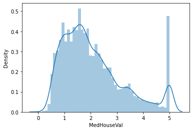
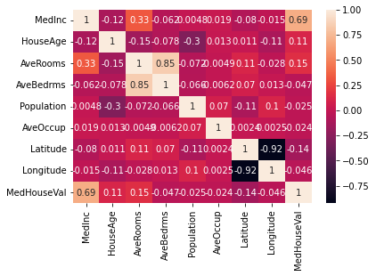
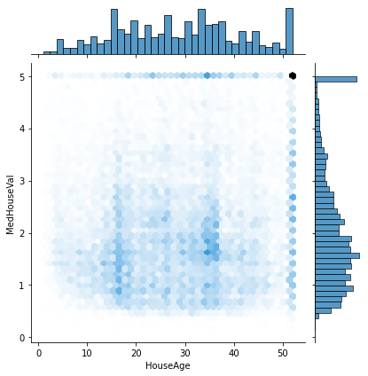
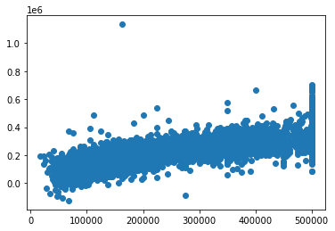
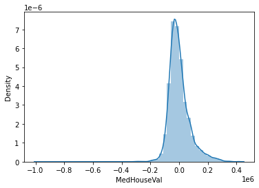

# Linear regression for California Housing Prices dataset
Creating a linear regression model to predict housing prices in California.

## The data
I'm using the 1990's California Housing dataset from SciKitLearn.
[California Housing Dataset](https://inria.github.io/scikit-learn-mooc/python_scripts/datasets_california_housing.html)

This dataset has 8 numeric, predictive attributes:

- MedInc        median income in block group
- HouseAge      median house age in block group
- AveRooms      average number of rooms per household
- AveBedrms     average number of bedrooms per household
- Population    block group population
- AveOccup      average number of household members
- Latitude      block group latitude
- Longitude     block group longitude

The target variable is the median house value for California districts, expressed in dollars.

We can quickly check the median price values (our target variable) by using seaborn to plot a [distribution plot](https://seaborn.pydata.org/generated/seaborn.distplot.html)

## The correlations
Taking a first look at the data, we can analyse the correlations by plotting a correlations heatmap

A correlation is a term used to represent the measure of linear relationship between two variables.
With this plot, we can easily check which variables have a strong relationship with each other.

Moreover, we can use the seaborn [jointplot](https://seaborn.pydata.org/generated/seaborn.jointplot.html?highlight=jointplot#seaborn.jointplot) function to plot the correlation between HouseAge and HousePrice 

## The Model & predictions

To train the model, I've split the dataset into:
- X array: Contains the features to train on
- y array: Contains the target variable (MedHouseVal)
Afterwards, I ran a train-test split on the data. The model will be trained with the X array, which we'll compare to the y array to evaluate the model.

I've used the [SciKitLearn library](https://scikit-learn.org/stable/) to fit the train and test data into the Linear Regression model.

Et voilá, the linear regression predictions model looks like this:

### Was this model the correct choice?
By plotting a histogram of our residuals, we can notice a normal distribution, which confirms that our choice of model was correct.

### A note on errors
SciKitLearn has in-built functions to calculate the three most common evaluation metrics for linear regression:
- Mean Absolute Error (MAE): The mean of the absolute value of the errors
- Mean Squared Error (MSE): The mean of the squared errors
- Root Mean Squared Error (RMSE): The square root of the mean of the squared errors

For this model, the metrics were:
- MAE: 53079.81652409564
- MSE: 5375475600.247601
- RMSE: 73317.63498809547 

## Libraries

| Name | Library |
| ------ | ------ |
| Pandas | https://pandas.pydata.org/ |
| Matplotlib | https://matplotlib.org/ |
| Seaborn | https://seaborn.pydata.org/ |
| SciKitLearn | https://scikit-learn.org/stable/ |